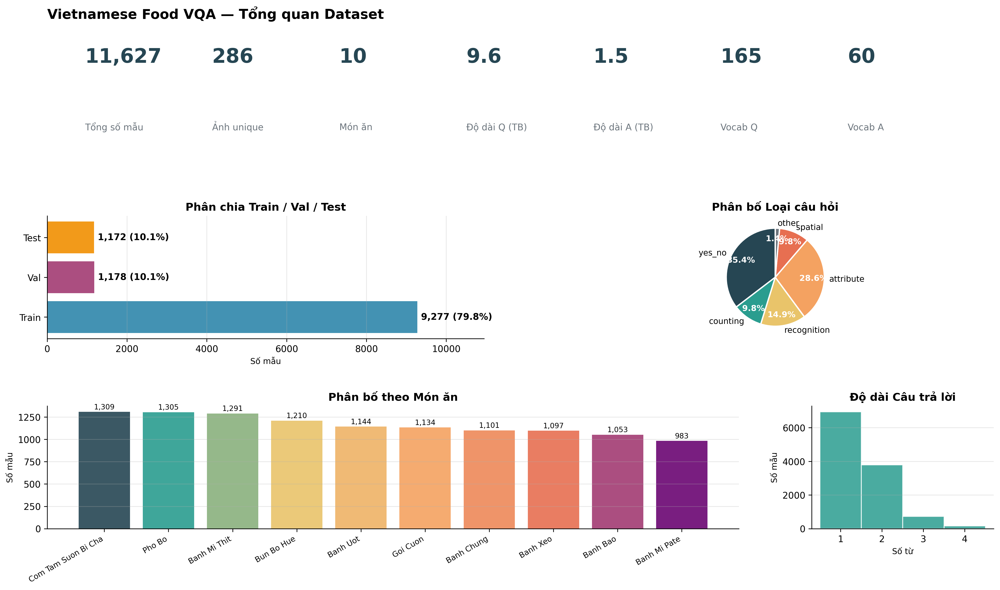
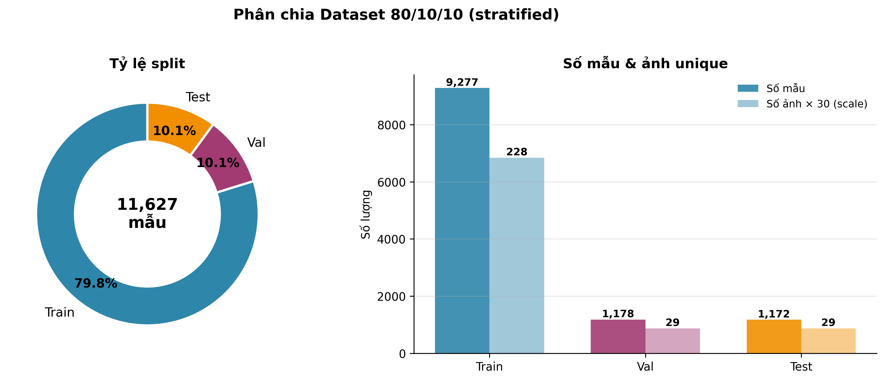
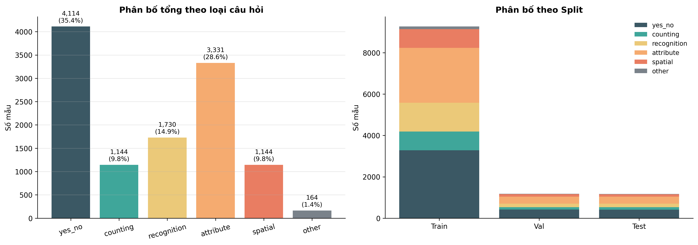
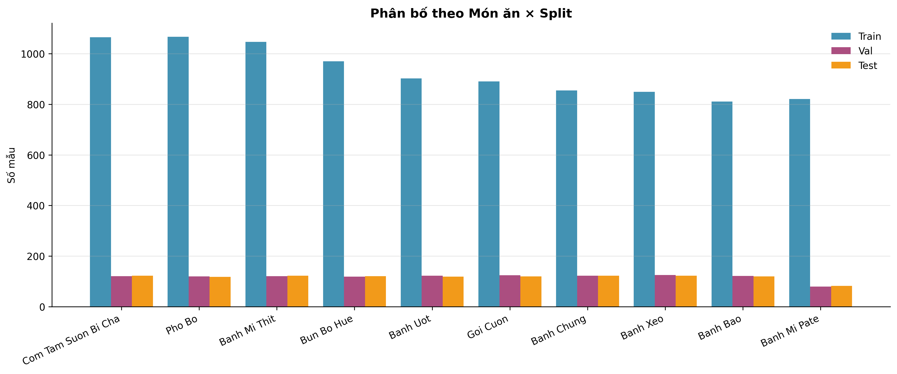

# 🍜 Vietnamese Food VQA

> **Visual Question Answering on Vietnamese Dishes**  
> Four model configurations — from custom scratch-trained to fine-tuned large VLMs — compared on a custom Vietnamese food dataset.

[](https://python.org)
[](https://pytorch.org)
[](https://gradio.app)
[](LICENSE)

---

## 📌 Overview

This project explores **Visual Question Answering (VQA)** for Vietnamese cuisine. Given an image of a Vietnamese dish and a question in Vietnamese, the system generates a natural-language answer.

We implement and compare **4 model configurations** across two design philosophies:

| Config | Architecture | Strategy |
|--------|-------------|----------|
| **A1** | ResNet-50 + PhoBERT + LSTM (Bahdanau Attention) | Train from scratch |
| **A2** | ResNet-50 + PhoBERT + Transformer Decoder (3L × 8H) | Train from scratch |
| **B1** | BLIP-2 OPT-2.7B + MarianMT Vi↔En | Zero-shot bridging |
| **B2** | Qwen2-VL-2B-Instruct + LoRA (4-bit NF4) | Fine-tuning (QLoRA) |

---

## 🗂️ Dataset

A custom dataset of **Vietnamese dishes**, annotated with question–answer pairs in Vietnamese.

| Split | Samples | Images |
|-------|---------|--------|
| Train | 9,277 | 228 |
| Val | 1,178 | 29 |
| Test | 1,172 | 29 |
| **Total** | **11,627** | **286** |

**10 food categories:**
`bánh mì thịt` · `bánh mì pate` · `bánh xèo` · `bánh ướt` · `bánh bao` · `bánh chưng` · `bún bò Huế` · `cơm tấm sườn bì chả` · `gỏi cuốn` · `phở bò`

**Question types:**

| Type | Count | Share |
|------|-------|-------|
| Yes/No | 4,114 | 35.4% |
| Attribute | 3,331 | 28.7% |
| Recognition | 1,730 | 14.9% |
| Counting | 1,144 | 9.8% |
| Spatial | 1,144 | 9.8% |
| Other | 164 | 1.4% |

<details>
<summary>Dataset figures</summary>

| Overview | Split Distribution |
|---|---|
|  |  |

| Question Types | Category Distribution |
|---|---|
|  |  |

</details>

---

## 🏗️ Model Architectures

### Model A — Custom VQA (Train from Scratch)

Both A1 and A2 share a dual-encoder design:
- **Visual encoder**: ResNet-50 (pretrained ImageNet, frozen backbone) → spatial feature map `7×7×2048`
- **Text encoder**: [PhoBERT-base](https://huggingface.co/vinai/phobert-base) (frozen) → contextual token embeddings
- **Fusion & Decoder**:
  - **A1**: Bahdanau cross-attention LSTM, beam search decoding
  - **A2**: 3-layer × 8-head Transformer Decoder, beam search decoding
- **Answer vocabulary**: 63 tokens built from training set

### Model B — Vision-Language Pre-trained (VLP)

#### B1 — Zero-Shot Bridging Pipeline
```
Vietnamese Question + Image
        ↓
  MarianMT (Vi → En)          # Helsinki-NLP/opus-mt-vi-en
        ↓
  BLIP-2 OPT-2.7B             # Salesforce/blip2-opt-2.7b
  (ViT-g/14 + Q-Former + OPT) # frozen, zero-shot
        ↓
  MarianMT (En → Vi)          # Helsinki-NLP/opus-mt-en-vi
        ↓
  Vietnamese Answer
```

#### B2 — Surgical Fine-Tuning with QLoRA
```
Vietnamese Question + Image
        ↓
  QwenCollator                # build_messages → process_vision_info
  (Naive Dynamic Resolution)  # min=256×28², max=384×28² pixels
        ↓
  Qwen2-VL-2B Vision Tower    # ViT frozen + MRoPE 3D (temporal+H+W)
  + Visual Merger (2×2)       # patch compression
        ↓
  Qwen2 LM 2B (4-bit NF4)    # BitsAndBytes double quantization
  + LoRA adapters             # r=16, α=32, q/k/v/o_proj
        ↓                     # trainable: 9.4M / 1,226M (0.355%)
  Vietnamese Answer
```

> **B2 training config**: `lr=2e-4`, `batch=4`, `grad_accum=4`, `warmup_ratio=0.03`, `epochs=3`, `compute_dtype=fp16`

---

## 📊 Results

All metrics evaluated on the **test split** (1,172 samples).

| Model | Exact Match | Token F1 | BLEU-1 | BLEU-2 | METEOR | ROUGE-L | BERTScore F1 | Sem. Sim. |
|-------|:-----------:|:--------:|:------:|:------:|:------:|:-------:|:------------:|:---------:|
| A1 | 3.84% | 49.22% | 37.49% | 24.19% | 42.41% | 48.88% | 81.67% | 67.93% |
| A2 | 5.29% | 56.61% | 43.65% | 29.64% | 46.81% | 57.31% | 84.95% | 79.85% |
| B1 | 0.51% | 6.45% | 4.37% | 1.68% | 6.06% | 14.42% | 68.35% | 45.39% |
| **B2** | **90.70%** | **91.80%** | **91.64%** | **54.30%** | **62.56%** | **92.12%** | **98.09%** | **96.58%** |

> **B2 dominates** across all metrics thanks to QLoRA fine-tuning on domain data.  
> **B1** underperforms due to the language-bridging bottleneck (OPT-2.7B generates noisy English before translation).  
> **A2 > A1** — the Transformer decoder captures richer context than LSTM.

<details>
<summary>Validation set results</summary>

| Model | Exact Match | Token F1 | BLEU-1 | METEOR | ROUGE-L | BERTScore F1 | Sem. Sim. |
|-------|:-----------:|:--------:|:------:|:------:|:-------:|:------------:|:---------:|
| A1 | 5.01% | 50.91% | 39.15% | 42.61% | 50.70% | 82.30% | 70.79% |
| A2 | 5.18% | 56.62% | 43.90% | 46.72% | 57.32% | 85.03% | 80.26% |
| B1 | 0.59% | 6.27% | 4.22% | 6.02% | 13.84% | 68.72% | 44.59% |
| **B2** | **92.28%** | **92.96%** | **92.87%** | **63.92%** | **93.25%** | **98.42%** | **98.05%** |

</details>

---

## 🗃️ Project Structure

```
VQA_Food_Project/
├── app.py                      # Gradio demo (local)
├── app_kaggle.py               # Gradio demo (Kaggle / T4×2)
├── vqa-model-a.ipynb           # Training notebook — Model A
├── vqa-model-b.ipynb           # Training notebook — Model B
├── VQA_Demo_Compare.ipynb      # Comparison notebook
│
├── data/
│   ├── annotations/
│   │   ├── train.json          # 9,277 QA pairs
│   │   ├── val.json            # 1,178 QA pairs
│   │   └── test.json           # 1,172 QA pairs
│   ├── images/                 # Food images (train/val/test)
│   ├── figures/                # Dataset visualizations
│   └── scripts/                # Data augmentation & analysis
│
├── checkpoints/
│   ├── best_model_A1.pth       # A1 weights
│   ├── best_model_A2.pth       # A2 weights
│   └── qwen2vl_lora_b2/
│       └── adapter_best/       # B2 LoRA adapter weights
│
├── results/
│   ├── results_A.json          # A1 & A2 evaluation results
│   └── results_B.json          # B1 & B2 evaluation results
│
└── assets/
    └── tdtu_logo.png
```

---

## 🚀 Quick Start

### Requirements

```bash
pip install gradio>=4.0 torch torchvision transformers peft bitsandbytes \
            qwen-vl-utils pillow pandas numpy nltk rouge-score \
            bert-score sentence-transformers openai anthropic
```

```python
import nltk
nltk.download(['wordnet', 'punkt', 'averaged_perceptron_tagger', 'omw-1.4'])
```

### Run Locally

```bash
python app.py
# → http://localhost:7860
```

Models are **lazy-loaded** on first inference call to conserve VRAM (≥8 GB GPU recommended for B2).

### Run on Kaggle (T4 × 2)

1. Upload your dataset to a Kaggle dataset named `vqa-food-project`  
   (folder structure must contain `data/` and `checkpoints/`)
2. In your Kaggle notebook:

```python
# Set your dataset slug at the top of app_kaggle.py
KAGGLE_DATASET_SLUG = "vqa-food-project"   # ← change if needed

exec(open("/kaggle/input/vqa-food-project/app_kaggle.py").read())
```

The script auto-detects Kaggle, installs dependencies, and launches with `share=True`.

> **GPU note**: B2 always uses `device_map={"": 0}` (bitsandbytes 4-bit requires a single GPU).  
> B1 uses `device_map="auto"` and spreads across both T4s when available.

---

## 🖥️ Demo Interface

The Gradio app (`app.py` / `app_kaggle.py`) provides:

- **Upload any image** or pick from the test set gallery
- **Ask a question** in Vietnamese (or any language)
- **Run all 4 models** simultaneously with a single click
- **Evaluation metrics** displayed per model (EM, Token F1, BLEU, METEOR, ROUGE-L, BERTScore, Semantic Similarity)
- **LLM-as-a-Judge** scoring via GPT-4o-mini or Claude (optional, requires API key)
- **Batch evaluation** over the full test set with exportable results

---

## 📐 Evaluation Metrics

| Metric | Description |
|--------|-------------|
| **Exact Match** | Strict string equality after normalization |
| **Token F1** | Precision/Recall/F1 on token bag overlap (Counter) |
| **BLEU-1/2** | N-gram precision with brevity penalty + smoothing |
| **METEOR** | Alignment-based (unigram + synonym matching) with fragmentation penalty |
| **ROUGE-L** | Longest Common Subsequence F1 |
| **BERTScore F1** | Contextual embedding similarity (greedy token matching) |
| **Semantic Sim.** | Cosine similarity via `paraphrase-multilingual-MiniLM-L12-v2` |
| **LLM Judge** | 0–10 score from GPT-4o-mini / Claude (structured JSON output) |

---

## 🔧 Key Implementation Details

<details>
<summary>B2 — QLoRA Training</summary>

```python
# 4-bit NF4 quantization
bnb_config = BitsAndBytesConfig(
    load_in_4bit=True,
    bnb_4bit_quant_type="nf4",
    bnb_4bit_use_double_quant=True,
    bnb_4bit_compute_dtype=torch.float16,
)

# LoRA on attention projections only
lora_config = LoraConfig(
    r=16, lora_alpha=32, lora_dropout=0.05,
    target_modules=["q_proj", "k_proj", "v_proj", "o_proj"],
    task_type=TaskType.CAUSAL_LM,
)
# Trainable params: ~9.4M / 1,226M (0.355%)
```

</details>

<details>
<summary>B2 — Custom Collator</summary>

```python
class QwenCollator:
    def __call__(self, batch):
        messages = [build_messages(img, q) for img, q, _ in batch]
        texts = processor.apply_chat_template(messages, tokenize=False)
        inputs = process_vision_info(messages)  # dynamic resolution
        labels = inputs["input_ids"].clone()
        labels[labels != answer_token_ids] = -100  # mask non-answer tokens
        return inputs | {"labels": labels}
```

</details>

<details>
<summary>B1 — Zero-Shot Bridging</summary>

```python
# Pipeline: Vi → En → BLIP-2 → En → Vi
def infer_b1(image, question_vi):
    question_en = translate_vi_to_en(question_vi)           # MarianMT
    answer_en = blip2_generate(image, question_en)           # BLIP-2 OPT
    answer_vi = translate_en_to_vi(answer_en)                # MarianMT
    return answer_vi
```

</details>

---

## 📚 References

- [Qwen2-VL](https://arxiv.org/abs/2409.12191) — Wang et al., 2024
- [BLIP-2](https://arxiv.org/abs/2301.12597) — Li et al., 2023
- [PhoBERT](https://arxiv.org/abs/2003.00744) — Nguyen & Nguyen, 2020
- [LoRA](https://arxiv.org/abs/2106.09685) — Hu et al., 2021
- [QLoRA](https://arxiv.org/abs/2305.14314) — Dettmers et al., 2023
- [BERTScore](https://arxiv.org/abs/1904.09675) — Zhang et al., 2019
- [METEOR](https://aclanthology.org/W05-0909/) — Banerjee & Lavie, 2005

---

## 👥 Author

Developed as a Deep Learning final project at **Ton Duc Thang University (TDTU)**.

Thanh Tung

---
## 📄 License

This project is licensed under the [MIT License](LICENSE).
